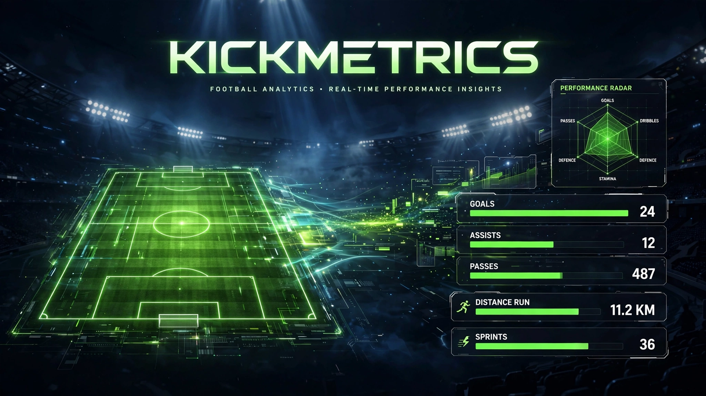

<div align="center">

# ⚽ KickMetrics


**A Blazor football analytics app that tracks player stats and breaks them down into performance, fitness, and injury reports — built with a clean strategy-pattern architecture.**

</div>

---

## 📸 Preview



## ✨ Features

- **Players page** — lists players with their name, position, age, and nationality
- **Stats page** — runs three pluggable stat calculators on a player:
  - 🥅 **Performance** — goals, assists, passes
  - 🏃 **Fitness** — distance run, sprint count
  - 🩹 **Injury** — games missed, injury type
- **Strategy pattern** — every metric implements `IStatCalculator`, so new calculators can be added without touching existing code
- **Service layer** — players are served through `IPlayerService` / `PlayerService` (currently backed by in-memory demo data)

## 🛠 Tech Stack

| Technology | Role |
|---|---|
| .NET 10 (C#) | Backend + application runtime |
| Blazor Server | Interactive web UI (Razor components) |
| Bootstrap | Responsive styling |
| Razor / CSS | Pages and layouts |

## 🚀 Getting Started

**Prerequisites:** [.NET 10 SDK](https://dotnet.microsoft.com/download)

```bash
# clone
git clone https://github.com/hussnainahmedd/Kickmetrics-.git
cd Kickmetrics-/KickMetrics

# run
dotnet run
```

Open your browser at:

- `http://localhost:5054` (or `https://localhost:7089`)

Routes: `/` (home) · `/players` · `/stats`

> 📝 The app currently runs on in-memory demo data (`Data/FakeData.cs`) — two sample players — so it works out of the box with no database setup.

---

<div align="center">

Built by **[Hussnain Ahmad](https://github.com/hussnainahmedd)** — learning by building. ⚽

</div>
